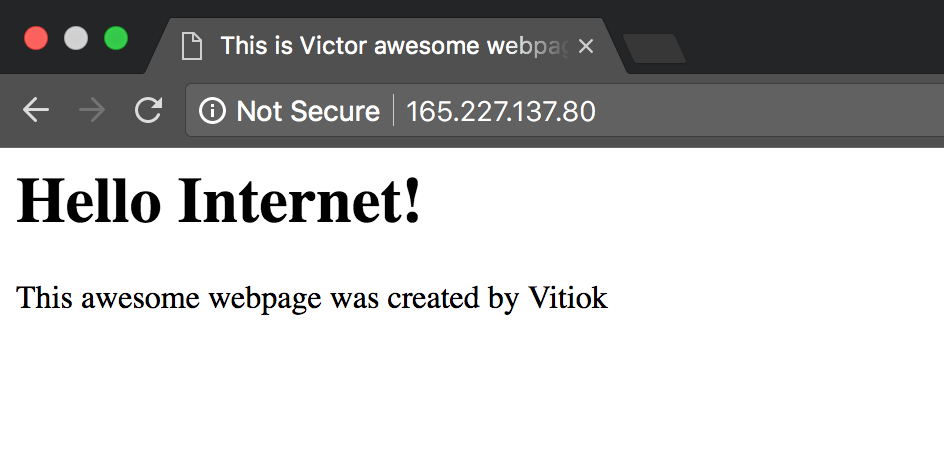
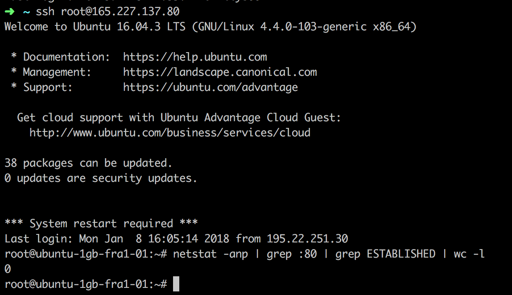
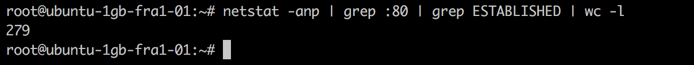
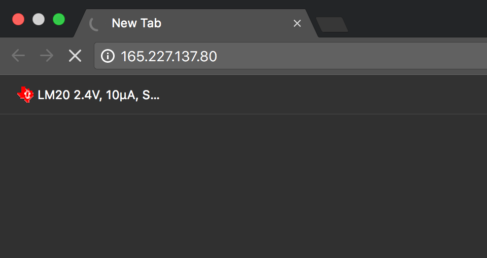

# Slowloris 
Computer Security

## Definition

Slowloris is a denial service attack invented by Robert "RSnake" Hansen which allows a single machine to take down another machine's web server with minimal bandwidth.

### How it works

Slowloris tries to keep many connections to the target web server open and hold them open as long as possible. It accomplishes this by opening connections to the target web server and sending a partial request. Periodically, it will send subsequent HTTP headers, adding to—but never completing—the request. Affected servers will keep these connections open, filling their maximum concurrent connection pool, eventually denying additional connection attempts from clients.

### Steps for implementation

Minimal slowloris attack configuration takes less than 100 lines of code. So, in order to implement this denial attack I followed the following steps:

1. Send a valid partial requests to the server. Partial - means it is not finished with double `\r\n`
2. Send invalid headers every 0.5 sec in order to keep connection open for as much time as possible.
3. Recreate connections which are closing.

### How it works

In order to accomplish this laboratory work I have used a [digitalocean](https://www.digitalocean.com/) droplet(server) and created an awesome [apache](https://httpd.apache.org/) based webpage.

In order to show that it works I used ssh to connect to droplet and to monitor the amount of `ESTABLISHED` connections on port 80.
Before the attack it is 0

After starting the script we can observe that the amount of connections with state `ESTABLISHED` raised and reached the upper limit which in
my case is 279

Since we used all the possible connections with attack users can't view webpage.

Closed connections are created again by script, thus ensuring that amount of used connections reaches upper bound all the time.